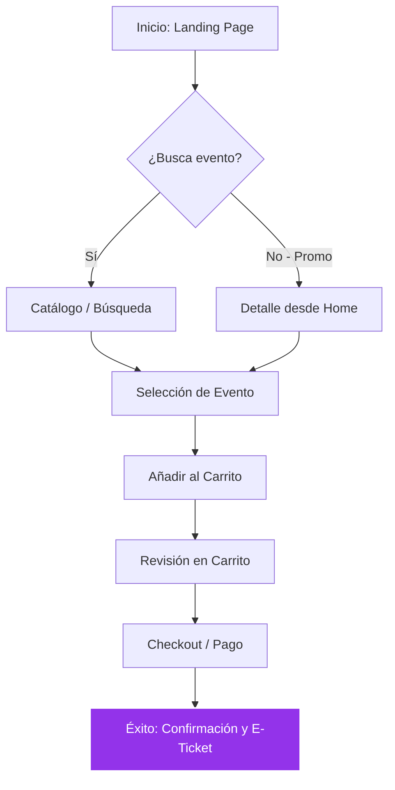

# Guía de Prototipado y Experiencia de Usuario - TicketLive

Este documento detalla el proceso de diseño y planificación de la experiencia de usuario (UX) para TicketLive, siguiendo las etapas de investigación, estructura y flujo de navegación.

## 🚀 ACTIVIDAD 02: Identificación de Páginas y Historias de Usuario

Para ofrecer una experiencia fluida, hemos identificado las vistas clave que componen el ecosistema de TicketLive.

### 🏠 Páginas de la Aplicación
1.  **Landing Page (Home)**: Recibe al usuario con un "Hero Section" impactante, eventos destacados y acceso rápido a las categorías.
2.  **Explorador de Eventos**: Una vista dedicada con potentes herramientas de filtrado y búsqueda para encontrar conciertos, festivales o eventos deportivos.
3.  **Detalle del Evento**: Página crítica donde se muestra la descripción, ubicación (mapa), precios, horarios y el botón de acción principal para comprar.
4.  **Carrito / Resumen**: Vista previa de la selección antes de proceder al pago, permitiendo ajustar cantidades.
5.  **Checkout / Pasarela**: Interfaz optimizada para el ingreso de datos de pago y confirmación de la transacción.
6.  **Dashboard de Usuario**: Espacio personal donde se almacenan los e-tickets adquiridos y el historial de compras.

### 👤 Historia del Usuario (User Story)
> "Como entusiasta de la música, quiero encontrar fácilmente el próximo concierto de mi artista favorito, conocer los detalles del evento y poder comprar mi entrada de forma segura en menos de 3 pasos, para asegurar mi asistencia sin complicaciones."

---

## 🗺️ ACTIVIDAD 03: Diagrama de Flujo (Happy Path)

El "Happy Path" representa el camino ideal que sigue el usuario desde que llega a la aplicación hasta que completa su compra con éxito.

---

## 🎨 EXTRA CREDIT: Traslado a Figma

El proceso de diseño evolucionó desde wireframes de baja fidelidad hasta prototipos dinámicos en Figma, integrando la identidad visual definida en [DESIGN.md](file:///c:/Users/leona/OneDrive/Escritorio/front/docs/DESIGN.md).

### Proceso de Refinamiento:
- **Wireframes**: Definición de jerarquías (bloques de contenido).
- **Componentización**: Creación de botones, cards y navegación reutilizable en Figma.
- **UI Design**: Aplicación de gradientes, efectos de *glassmorphism* y tipografía moderna para dotar a la aplicación de un aspecto *premium*.
- **Prototipado**: Conexión de pantallas para validar el "Happy Path" antes de la codificación en React/Next.js.

---

## 🧪 Validación y Pruebas
1.  **Pruebas de Usabilidad**: Observamos a usuarios reales interactuando con el prototipo de Figma para identificar cuellos de botella.
2.  **Iteración Continua**: Ajustamos los campos de los formularios y la visibilidad del "Carrito" basándonos en el feedback de las pruebas.

